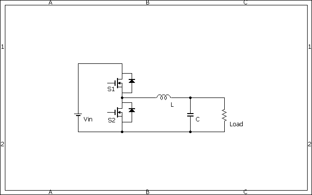

# 降圧比の大きいチョッパの制御に失敗した話(シミュレーションベース)
### Sim環境
-Plecs

---
### はじめに
やりたいこと
- 12Vくらいで100A出力の直流電源がほしい
- おおもとの電源は単相100Vを整流した直流141V
- もしくは、低電流電源装置の100V
- 降圧の比は1/8程度

---
### ひとまず、チョッパでDC-DC変換を考える

- ひとまずVinは100V
- 負荷は120Aとなるような純抵抗負荷 (マージン20%)
- 降圧比が高すぎてDuty比が大変なことに・・・

(おそらく)平均のDuty比は0.12くらい
無理では？？？

+++
### もしくはトランスで降圧？
問題点
- トランスの巻線太さは1sq:6Aとする(もうちょい余裕欲しい・・・)
- 二次側の巻線太さ@120A : ** 20sq **

＿人人人人人人＿
＞　  20sq  　＜
￣Y^Y^Y^Y^Y^Y￣

巻けない・・・

---
### チョッパを2段にする作戦
 - Vin=100V
 - 初段出力&次段入力電圧 Vmid=50V
 - 二段目出力 Vout=12V
 
 * 100:50:12 * つまり * 約 x0.5 x0.24 * いけるのでは？
 
 ---
！[alt](assets/BidirectionChopper_2part.bmp)

この条件でシミュレーションを進める

---
近々続きを書きます。
